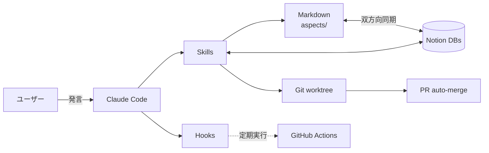

<p align="center">
  <h1 align="center">Life</h1>
  <p align="center">
    AI が日記を読んで、明日のタスクが進化する人生管理リポジトリ
    <br/>
    <i>A self-evolving life management system, powered by Claude Code</i>
  </p>
  <p align="center">
    <a href="LICENSE"></a>
    <a href="https://claude.com/claude-code"></a>
    <a href="https://github.com/kokiebisu/life-os"></a>
    <a href="https://github.com/kokiebisu/life/actions/workflows/ci.yml"></a>
  </p>
</p>

---

## Overview

Life は Claude Code を使って人生の各側面（食事・運動・学習・信仰など）を自動で記録・計画・進化させるリポジトリ。日記や会話から AI が文脈を読み、Notion と Markdown を双方向に同期しつつ、変更を自動で PR にまとめる。

## Features

- 🤖 自然言語で起動する 22 のカスタム Skill
- 🔁 Notion ⇔ Markdown 双方向同期（5+ DB）
- 🚀 発言 → worktree → PR → auto-merge を自動化
- 🪝 Hook 駆動の品質チェック（AI 臭検知 / セッション分離）
- 🧠 `/learn` による自己進化ルール
- 🗓️ GitHub Actions による定期タスク（食事計画・ジム・整理）
- 📚 忘却曲線ベースの復習エンジン

## Architecture



## Examples

実際によく使うフロー。

### 献立を計画

> 「今週の献立考えて」

`/kondate` が `fridge.md` を読み → 4 食分の主菜を提案 → 承認後 Notion 食事 DB と daily ログに一括登録。

### ジム記録

> 「ジム終わった、ベンチ 70kg×8」

`/gym log` が種目・重量・回数をパース → Notion ジム DB に同期 → 次回のプランに反映。

### デボーション

> 「デボーションやろう」

`/devotion` が前回読んだ章から次の章を自動検出 → 学び・祈りのリストを記録 → Markdown と Notion に同期。

### 面接対策

> 「Go の goroutine やろう」

`/interview-prep` が対話形式で問答 → 弱点を Notion 学習 DB に蓄積 → 後日 `/fukushuu` で再出題。

### 学習セッション

> 「今日は分散システム勉強する」

`/study` がセッションを開始 → ノートを Markdown で記録 → Notion 学習 DB に登録。

### 復習

> 「復習しよう」

`/fukushuu` が忘却曲線ベースで期日が来たノートを抽出 → クイズ形式で出題 → 結果に応じて次回期日を再計算。

## Quick Start

```bash
./dev
```

devcontainer が起動して Claude Code が自動で開く。

## Project Structure

```
aspects/           生活の各側面
  daily/           デイリーログ
  devotions/       デボーションノート
  events/          一回限りの予定
  tasks.md         タスク管理（Inbox / Archive）
  people/me.md     プロフィール
scripts/           Notion 連携・ユーティリティ
skills/            Claude Code スキル定義
docs/              設計ドキュメント
.github/workflows/ GitHub Actions（定期タスク）
```

## Aspects

各アスペクトには領域特化の AI ペルソナ（例: diet なら栄養士・トレーナー）が設定されており、相談時に呼び出せる。

| アスペクト                    | 説明                   | AI ペルソナ |
| ----------------------------- | ---------------------- | ----------- |
| [diet](aspects/diet/)         | 減量・健康管理         | 6           |
| [gym](aspects/gym/)           | ジムセッション記録     | -           |
| [guitar](aspects/guitar/)     | ギター練習             | 3           |
| [study](aspects/study/)       | 起業・法律・技術の学習 | 9           |
| [job](aspects/job/)           | 就職・転職活動         | 6           |
| [reading](aspects/reading/)   | 読書記録               | 1           |
| [church](aspects/church/)     | 教会・音響 PA          | 3           |
| [shopping](aspects/shopping/) | 買い物・冷蔵庫在庫管理 | -           |
| [fashion](aspects/fashion/)   | ワードローブ管理       | -           |

## Skills

### 記録系（その日に起きたことを残す）

`/meal` `/devotion` `/gym` `/study` `/event`

### 計画系（先のことを決める）

`/kondate` `/calendar` `/interview-prep`

### 学習・思考系

`/fukushuu` `/ask-diet`

### 同期・運用系

`/to-notion` `/from-notion` `/fridge-sync` `/pr`

### メタ系（システム自体を進化させる）

`/learn` `/tidy` `/analyze` `/humanize-ja` `/automate` `/backfill-cues` `/defer` `/resume`

## Tech Stack

Claude Code · TypeScript · Bun · Notion API · GitHub Actions

## Related

- [life-os](https://github.com/kokiebisu/life-os) — upstream template

## License

MIT — see [LICENSE](LICENSE).

## Author

沖胡献一 (Ken) — [About](aspects/people/me.md)

## Note

This is a personal fork of [life-os](https://github.com/kokiebisu/life-os). The patterns are reusable; the data is mine. If you want a clean template, fork life-os instead.
